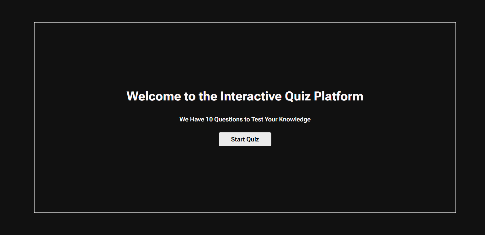
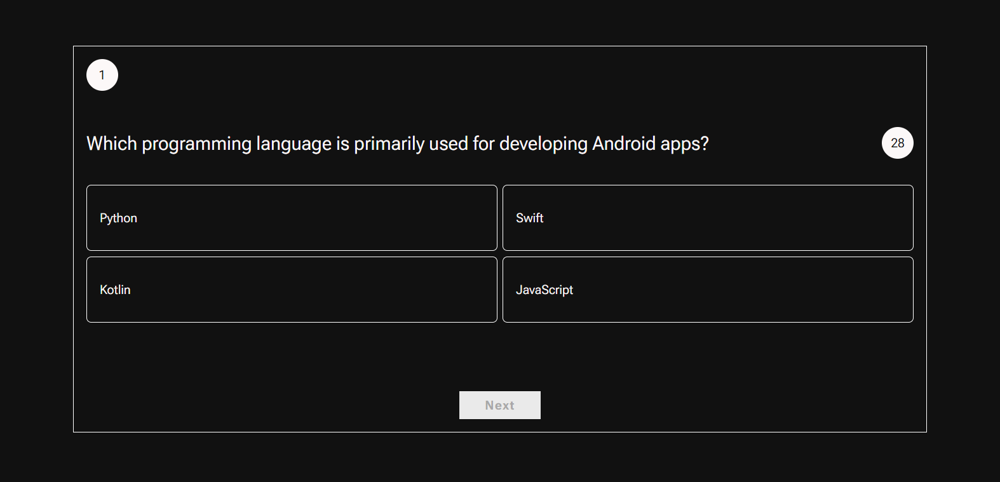

# 🚀 Interactive Quiz Web Application

This is a fully responsive and interactive **Quiz Web App** built using HTML, CSS, and JavaScript. The application dynamically loads quiz questions from a JSON file, supports timers, provides animated feedback on answers, and shows a detailed result screen.

---

---

## Demo

Check out the live demo here:  
🔗 [Quiz-app Live](https://udithshankarg.github.io/Quiz/)

### Screenshots

| Location Permission Prompt       | Main UI View                   | Search Input                |
|---------------------------------|-------------------------------|---------------------------------|
|      |                |   |

---
## 📸 Features

- 🧠 Dynamic quiz questions loaded from JSON
- ✅ Correct/❌ Incorrect answer feedback with custom SVG icons
- 🎯 Score tracking
- ⏳ 30-second timer per question
- 📊 Result screen with total score
- 🔁 Restart functionality
- 💬 Motivational/correct feedback messages with animated styles
- 📱 Fully responsive UI with gradient colors and modern design

---

## 🛠️ Technologies Used

- **HTML5**
- **CSS3** (with gradients and animations)
- **Vanilla JavaScript (ES6)**
- **SVG Icons**
- **JSON** for question data

---

## 🧪 Project Structure

```
quiz-app/
├── index.html
├── style.css
├── script.js
├── question.json
├── assets/
│ └── (Optional icons/images here)
└── README.md
```

---

## 🧩 How It Works

1. **Welcome Page**: Click `Start Quiz` to begin.
2. **Category & Question Display**: Questions are shown one by one with 4 options.
3. **Timer**: Each question has a 30-second countdown timer.
4. **Feedback**:
   - ✅ Correct: Shows a green message with praise.
   - ❌ Incorrect: Shows a red message with motivational encouragement.
5. **Score Display**: At the end, a result page displays:
   - Score
   - Total Questions
6. **Restart**: Option to restart the quiz from the beginning.

---

## 📦 Sample Question Format (`question.json`)

```json
[
  {
    "question": "What is the capital of France?",
    "options": ["Berlin", "Madrid", "Paris", "Rome"],
    "correctIndex": 2
  },
  {
    "question": "Which language runs in a web browser?",
    "options": ["Java", "C", "Python", "JavaScript"],
    "correctIndex": 3
  }
]
```
## Author
### Buit by Udith Shankar
